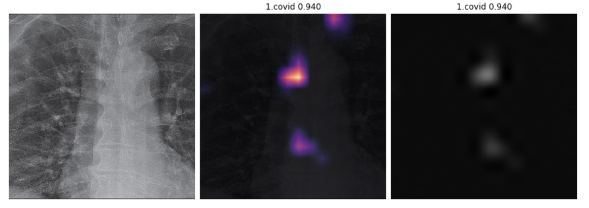

# Covid-19 Experiment 
- Tried to classify Covid-19 from x-ray and used class activation mapping to indicate the affected area. It's not for real life use as the data set is small and did it experimentally. Need to wrok on model improvement too.

## Dataset 
- https://github.com/ieee8023/covid-chestxray-dataset
## Reference
- https://towardsdatascience.com/detecting-covid-19-induced-pneumonia-from-chest-x-rays-with-transfer-learning-an-implementation-311484e6afc1
- https://www.kaggle.com/c/aptos2019-blindness-detection/discussion/99753
- https://dhruvs.space/posts/grad-cam-heatmaps-along-resnet-34/
- 
